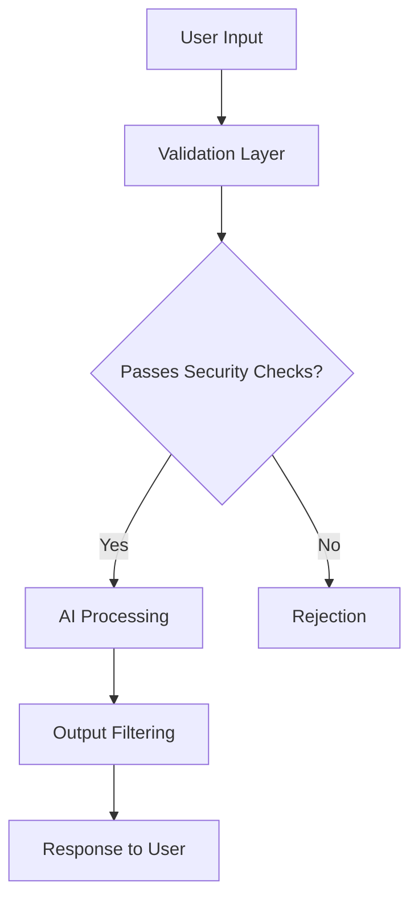

# Securing Generative AI: Best Practices for Enterprise Deployment

As organizations increasingly adopt generative AI technologies, security considerations must be at the forefront of implementation strategies. This comprehensive guide outlines key security practices for ensuring safe deployment of generative AI in enterprise environments, with practical recommendations you can implement today.

## Understanding the Threat Landscape

Generative AI systems introduce unique security challenges that traditional security frameworks may not fully address:

- **Prompt injection attacks**: Malicious inputs designed to manipulate model outputs
- **Data poisoning**: Contaminating training data to influence model behavior
- **Model extraction**: Stealing model capabilities through systematic querying
- **Privacy leakage**: Inadvertent disclosure of sensitive information in responses
- **Unauthorized access**: Exploitation of API or access control weaknesses

## Essential Security Controls

### 1. Robust Access Management

Implement strict identity and access controls for both model training and inference. Ensure that access to the model APIs follows the principle of least privilege.

- Use strong authentication mechanisms, including MFA for all AI system access
- Implement role-based access control (RBAC) with fine-grained permissions
- Regularly audit access logs and user permissions
- Consider implementing just-in-time access for sensitive AI operations

### 2. Input Validation and Sanitization

Always validate and sanitize inputs to generative AI systems to prevent prompt injection and other manipulation attempts.

- Develop and maintain an allowlist of permitted prompt patterns
- Implement content filtering for potentially harmful inputs
- Consider using a security intermediary layer between users and the AI system
- Test your system against known prompt injection techniques

### 3. Output Filtering

Implement appropriate output filtering mechanisms to prevent generation of harmful or sensitive content.

- Deploy content moderation systems that scan AI outputs before delivery
- Establish clear thresholds for blocking potentially harmful content
- Consider implementing human review for high-risk scenarios
- Regularly update output filters based on new patterns and attack vectors

### 4. Data Protection

Apply comprehensive data protection measures for both training data and data processed by the model during inference.

- Implement data minimization principles to limit exposure of sensitive information
- Use strong encryption for data in transit and at rest
- Consider differential privacy techniques for training data
- Establish clear data retention policies and secure deletion procedures

### 5. Continuous Monitoring

Establish monitoring systems that can detect unusual patterns or potential security breaches in real-time.

- Deploy anomaly detection systems to identify unusual query patterns
- Monitor for data exfiltration attempts through systematic querying
- Implement rate limiting to prevent abuse
- Establish incident response procedures specific to AI systems

## Conclusion

Security must be a foundational element of any generative AI deployment. By implementing these best practices, organizations can harness the power of generative AI while maintaining robust security postures. The rapidly evolving nature of AI threats means that security must be an ongoing commitment, with regular updates to controls and monitoring systems.

For more information on implementing these controls in your organization, contact our security team or refer to the latest AI security frameworks from organizations such as OWASP and NIST. 