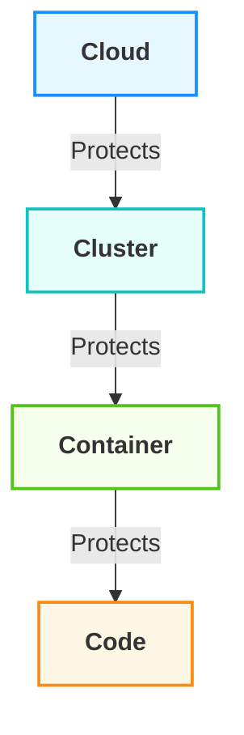

# The Essential Guide to Kubernetes Security: Protecting Your Container Ecosystem

## Introduction

In today's rapidly evolving cloud-native landscape, Kubernetes has emerged as the de facto standard for container orchestration. As organizations increasingly adopt Kubernetes to manage their containerized applications, securing these environments has become paramount. According to recent studies, human error remains a key contributor to leading cyberattack tactics in Kubernetes environments. With the growing complexity of Kubernetes deployments, a comprehensive security approach is essential to protect your critical infrastructure and data.

This guide explores the fundamental concepts of Kubernetes security through the lens of the industry-standard 4C security model, providing practical recommendations and best practices to help you build a robust security posture for your Kubernetes deployments.

## Understanding the 4C Security Model

Kubernetes has been designed with security in mind, following a multi-layered model approach known as the "4C" security model, inspired by the Defense in Depth (DiD) concept. This model organizes cloud-native security into four distinct layers: Cloud, Cluster, Container, and Code.

Each layer in this model provides its own security capabilities and features, with each outer layer shielding the inner layers. Let's visualize this model:

Let's explore each layer of the 4C model and understand how to secure it effectively.

## 1. Cloud Security Layer

The cloud layer forms the outermost security perimeter of your Kubernetes environment. Vulnerabilities in your cloud infrastructure—such as not enabling 2FA for your cloud provider accounts—can enable attackers to access all your resources.

### Best Practices for Cloud Security

- **Implement Robust Access Controls**: Enforce least privilege principles for all cloud resources and enable multi-factor authentication.
- **Network Security**: Use network security groups, firewalls, and other security mechanisms to control access to your Kubernetes control plane and worker nodes.
- **Regular Auditing**: Regularly audit your cloud infrastructure configuration as it is dynamic by nature and may change significantly over time.
- **Choose Reputable Providers**: Select cloud providers with strong security practices and compliance records.

## 2. Cluster Security Layer

The cluster layer encompasses the Kubernetes components that form both the control plane and worker nodes.

### Best Practices for Cluster Security

- **API Server Security**: A key security mechanism for any Kubernetes cluster is to control access to the Kubernetes API. Kubernetes expects you to configure and use TLS to provide data encryption in transit within the control plane, and between the control plane and its clients.
- **Role-Based Access Control (RBAC)**: RBAC is a highly granular access control method that restricts users from certain assets based on their position within your organization. It grants users access only to the most essential resources they need to perform their tasks.
- **Network Policies**: Implement network policies to control pod-to-pod communication and isolate sensitive workloads.
- **Secrets Management**: As one of your Kubernetes security best practices, you should implement encryption and secret management processes to restrict your secret access. Encryption is off by default, so configure it using the kube-apiserver process.
- **Regular Updates**: Kubernetes is a rapidly evolving technology with active development. Keeping your cluster up-to-date with the latest security patches and updates is essential.

## 3. Container Security Layer

The container layer focuses on securing the images and runtime environments of your containerized applications.

### Best Practices for Container Security

- **Use Trusted Images**: It's important to use trusted sources for your container images. This can reduce the risk of downloading images that contain malicious code or vulnerabilities.
- **Immutable Containers**: Enforce immutable container images to prevent runtime modifications that could introduce vulnerabilities.
- **Vulnerability Scanning**: Regularly scan your container images for known vulnerabilities and security issues.
- **Resource Limitations**: Set appropriate CPU and memory limits for containers to prevent resource exhaustion attacks.
- **Secure Runtime**: Use secure container runtimes that incorporate advanced security mechanisms like seccomp and AppArmor to help prevent container breakout attacks.

## 4. Code Security Layer

The innermost layer, code security, focuses on the application code running within your containers.

### Best Practices for Code Security

- **Shift-Left Security**: The shift-left security approach aims to integrate security measures into the early stages of the application development process. This involves incorporating security checks and practices right from the design and development stages rather than waiting until the application is ready for deployment.
- **Static and Dynamic Analysis**: Implement static code analysis and dynamic application security testing in your CI/CD pipeline.
- **Secure Coding Practices**: Train developers on secure coding practices and maintain coding standards.
- **Dependency Management**: Regularly update and scan application dependencies for vulnerabilities.
- **Input Validation**: Implement robust input validation to prevent injection attacks.

## Implementing a Comprehensive Security Strategy

An effective Kubernetes security strategy should address all four layers of the 4C model. Here are some key components of a comprehensive approach:

### 1. Continuous Monitoring and Logging

Implement logging for both cluster events and application-level activities. Store logs securely and regularly review them to identify and respond to anomalies. Use tools like Prometheus and Grafana to monitor metrics, track resource usage, and detect any unusual activity that may indicate security threats.

### 2. Compliance as Code

Compliance-as-code (CaC) is a methodology that involves defining and managing compliance standards as code, allowing them to be integrated into the software development lifecycle. With CaC, Kubernetes configurations can be checked against compliance standards as part of the CI/CD process.

### 3. Zero Trust Security Model

The Zero Trust approach is rapidly becoming the Kubernetes security mantra. This "never trust, always verify" approach includes granular access controls, least-privilege principles, and micro-segmentation – building fortresses around your containers to prevent unauthorized access.

### 4. Security Education and Awareness

You can implement all the policies and tools you want, but none can override the human component. The only solution is proper education and raising awareness, so if you truly want to implement Kubernetes security best practices, continuously educate your teams on the most important security protocols and the latest emerging threats.

## Conclusion

Securing Kubernetes environments requires a multi-layered approach that addresses all aspects of the 4C security model. By implementing the best practices outlined in this guide, organizations can significantly reduce their Kubernetes attack surface and protect their containerized applications from evolving cyber threats.

Remember that Kubernetes security is not a one-time task but an ongoing process. Regular assessments, updates, and continuous improvement are essential to maintain a strong security posture in the ever-changing cloud-native landscape.

## References

1. [15 Kubernetes Security Best Practices in 2025](https://www.strongdm.com/blog/kubernetes-security-best-practices)
2. [Kubernetes Security Best Practices in 2025 - Practical DevSecOps](https://www.practical-devsecops.com/kubernetes-security-best-practices/)
3. [Security | Kubernetes](https://kubernetes.io/docs/concepts/security/)
4. [Kubernetes Security Best Practices for 2024 - Cloud Native Now](https://cloudnativenow.com/features/kubernetes-security-best-practices-for-2024/)
5. [Kubernetes Security Best Practices 2024 Guide](https://www.esecurityplanet.com/applications/kubernetes-security-best-practices/)
6. [The 4C's Security Model in Kubernetes](https://www.enterprisedb.com/blog/4cs-security-model-kubernetes)
7. [Kubernetes Security Trends You Must Know in 2025 - Practical DevSecOps](https://www.practical-devsecops.com/kubernetes-security-trends/)
8. [Kubernetes Security Best Practices | CrowdStrike](https://www.crowdstrike.com/en-us/cybersecurity-101/cloud-security/kubernetes-security-best-practices/)
