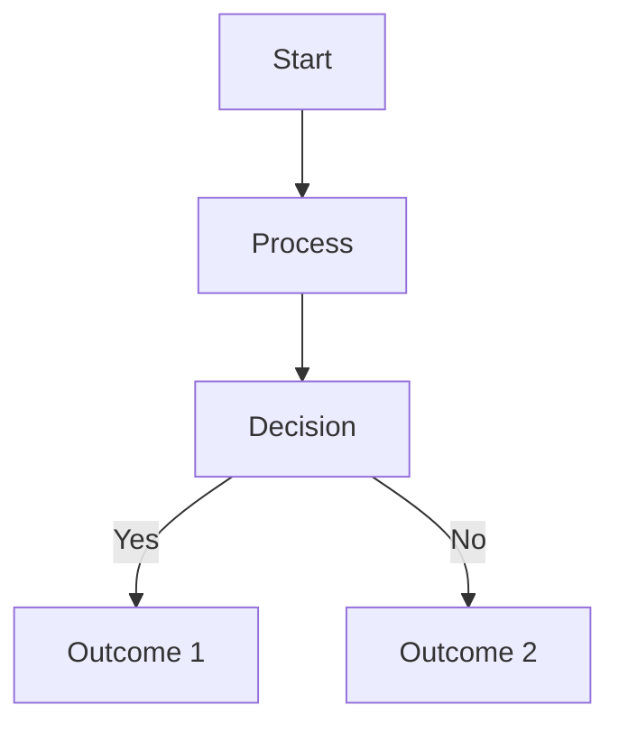

# Modern Cloud Security Patterns for Big Data Workloads

Securing big data workloads in cloud environments presents unique challenges that require specialized approaches. This article explores efficient security patterns that can help organizations protect their data while maintaining performance and scalability.

## Key Security Patterns

### 1. Segmentation and Isolation

Implement strong network segmentation and workload isolation to contain potential breaches and limit lateral movement.

### 2. Data-Centric Security

Focus on protecting the data itself, not just the perimeter, through encryption, tokenization, and data loss prevention techniques.

### 3. Automated Compliance

Use infrastructure as code and policy as code to automate security compliance across your big data infrastructure.

### 4. Continuous Verification

Implement zero trust principles with continuous verification of identities, devices, and access rights.

### 5. Observability

Maintain comprehensive logging, monitoring, and alerting to detect security issues early.

## Implementation Strategies

When implementing these patterns in AWS environments:

- Leverage Lake Formation for fine-grained access control
- Implement column-level and row-level security in your data stores
- Use EMR security configurations to enforce encryption and authentication
- Set up VPC endpoints to keep traffic private
- Implement automated security group and IAM policy analysis

## Conclusion

By adopting these security patterns, organizations can build resilient security architectures for their big data workloads in the cloud, enabling both innovation and protection. 