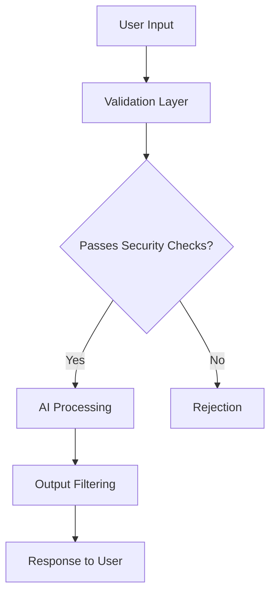

# Securing Generative AI: Best Practices for Enterprise Deployment

As organizations increasingly adopt generative AI technologies, security considerations must be at the forefront of implementation strategies. This article outlines key security practices for ensuring safe deployment of generative AI in enterprise environments.

## Understanding the Threat Landscape

Generative AI systems introduce unique security challenges:

- Prompt injection attacks
- Data poisoning
- Model extraction
- Privacy leakage
- Unauthorized access

## Essential Security Controls

### 1. Robust Access Management

Implement strict identity and access controls for both model training and inference. Ensure that access to the model APIs follows the principle of least privilege.

### 2. Input Validation and Sanitization

Always validate and sanitize inputs to generative AI systems to prevent prompt injection and other manipulation attempts.

### 3. Output Filtering

Implement appropriate output filtering mechanisms to prevent generation of harmful or sensitive content.

### 4. Data Protection

Apply comprehensive data protection measures for both training data and data processed by the model during inference.

### 5. Continuous Monitoring

Establish monitoring systems that can detect unusual patterns or potential security breaches in real-time.

## Conclusion

Security must be a foundational element of any generative AI deployment. By implementing these best practices, organizations can harness the power of generative AI while maintaining robust security postures. 