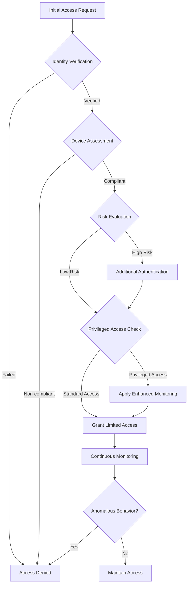

In today's rapidly evolving digital landscape, traditional security models built around the concept of "trust but verify" have become increasingly obsolete. With remote work, cloud adoption, and sophisticated cyber threats on the rise, organizations must fundamentally rethink their security architectures. Enter Zero Trust—a security framework that has moved from buzzword to necessity in 2025.

## Understanding Zero Trust: Beyond the Perimeter

Zero Trust is built on a simple yet powerful principle: "never trust, always verify." Unlike conventional security approaches that focus on defending the network perimeter, Zero Trust assumes that threats exist both inside and outside the network. This fundamental shift recognizes that in today's interconnected world, the traditional network boundary has essentially dissolved.

As CrowdStrike notes, Zero Trust is "a security framework that mandates stringent identity verification for every user and device attempting to access resources, regardless of whether they are inside or outside the organization's network." This approach is particularly crucial now that the global cybersecurity landscape faces unprecedented challenges, with research revealing over 30,000 vulnerabilities disclosed last year—a 17% increase from previous figures.

## Why Zero Trust Matters in 2025

Several factors have made Zero Trust essential for modern security strategies:

### 1. Evolving Threat Landscape

The sophistication of cyber threats has increased dramatically. According to recent research, malware-free attacks now account for 79% of all detected intrusions. These attacks bypass traditional security measures by exploiting trusted identities and applications rather than deploying malicious code.

### 2. Remote and Hybrid Work Realities

With distributed workforces accessing corporate resources from various locations and devices, the traditional network perimeter is no longer relevant. Zero Trust provides a framework that adapts to this new reality by focusing on securing each access request regardless of its origin.

### 3. Supply Chain Vulnerabilities

Supply chain security has become a critical concern, with 54% of large organizations identifying it as the biggest barrier to achieving cyber resilience. Zero Trust helps address this challenge through continuous verification of third-party connections and strict access controls.

### 4. AI-Powered Threats

Adversaries are increasingly leveraging AI to enhance their attacks. In fact, 47% of organizations cite AI-powered adversarial advances as their primary security concern. Zero Trust's continuous monitoring and verification approach provides better protection against these sophisticated threats.

## Core Principles of Zero Trust Architecture

Implementing Zero Trust involves adhering to several key principles:

### 1. Verify Explicitly

Every access request must be fully authenticated, authorized, and encrypted before granting access. This verification applies to all users, devices, and applications, regardless of location.

### 2. Use Least Privileged Access

Access should be limited to only what's necessary, using just-in-time and just-enough-access principles, risk-based adaptive policies, and data protection to secure both data and productivity.

### 3. Assume Breach

Minimize the blast radius and segment access. Verify end-to-end encryption and use analytics to detect threats and improve defenses.

## Implementing Zero Trust in Your Organization

Transitioning to a Zero Trust model requires a strategic approach:

### 1. Start with Identity and Access Management

Identity has become the new perimeter. Implement robust identity verification through:
- Multi-factor authentication (MFA)
- Risk-based conditional access policies
- Privileged access management

### 2. Secure Endpoints and Devices

Ensure all devices meet security standards before allowing access:
- Implement endpoint detection and response (EDR) solutions
- Enforce device compliance policies
- Deploy next-generation antivirus protection

### 3. Apply Micro-segmentation

Break up security perimeters into small zones to maintain separate access for separate parts of the network:
- Create granular perimeters around data
- Implement application-level segmentation
- Deploy next-generation firewalls

### 4. Continuous Monitoring and Validation

Establish comprehensive visibility into your environment:
- Deploy security information and event management (SIEM) solutions
- Implement user and entity behavior analytics (UEBA)
- Develop automated response capabilities

## Real-World Implementation Challenges

While the benefits of Zero Trust are clear, implementation comes with challenges:

### 1. Legacy System Integration

Many organizations struggle to apply Zero Trust principles to legacy systems. Addressing this requires:
- Gradual implementation starting with critical assets
- API-based integration where possible
- Use of proxies and gateways to extend controls

### 2. Cultural Resistance

Zero Trust requires a shift in security mindset from "trust but verify" to "never trust, always verify." This cultural shift requires:
- Executive sponsorship
- Comprehensive security awareness training
- Clear communication about the benefits and necessity

### 3. Resource Constraints

Implementing Zero Trust requires investment in both technologies and skills. Organizations should:
- Develop a phased implementation plan
- Leverage existing security investments where possible
- Consider managed security services for specialized capabilities

## The Future of Zero Trust

As we look beyond 2025, Zero Trust will continue to evolve in response to emerging threats and technologies:

### 1. AI and Automation

Machine learning will enhance Zero Trust implementations by:
- Improving anomaly detection
- Enabling more granular risk assessments
- Automating response to potential threats

### 2. Extended Zero Trust Ecosystems

Zero Trust principles will extend beyond organizational boundaries to:
- Secure supply chain interactions
- Enable safer collaboration between organizations
- Create trusted digital ecosystems

### 3. Zero Trust for IoT and OT

The principles of Zero Trust will be adapted for:
- Industrial control systems
- Internet of Things (IoT) devices
- Critical infrastructure

## Conclusion

Zero Trust has emerged as the cornerstone of modern cybersecurity strategy in 2025. By embracing its principles of continuous verification, least privilege access, and assuming breach, organizations can significantly improve their security posture in the face of evolving threats.

While implementing Zero Trust requires commitment and investment, the alternative—continuing to rely on perimeter-based security in a perimeter-less world—leaves organizations vulnerable to increasingly sophisticated attacks. As cyber threats continue to evolve, Zero Trust provides a framework for security that can evolve with them.

## References

1. "What is Zero Trust? - Guide to Zero Trust Security" - CrowdStrike. [https://www.crowdstrike.com/en-us/cybersecurity-101/zero-trust-security/](https://www.crowdstrike.com/en-us/cybersecurity-101/zero-trust-security/)

2. "Global Cybersecurity Outlook 2025" - World Economic Forum. [https://www.weforum.org/publications/global-cybersecurity-outlook-2025/digest/](https://www.weforum.org/publications/global-cybersecurity-outlook-2025/digest/)

3. "10 Cyber Security Trends For 2025" - SentinelOne. [https://www.sentinelone.com/cybersecurity-101/cybersecurity/cyber-security-trends/](https://www.sentinelone.com/cybersecurity-101/cybersecurity/cyber-security-trends/)

4. "Cybersecurity Forecast 2025" - Google Cloud. [https://cloud.google.com/security/resources/cybersecurity-forecast](https://cloud.google.com/security/resources/cybersecurity-forecast)

5. "Zero Trust Security Framework Implementation Guide" - iLink Digital. [https://www.ilink-digital.com/insights/blog/implementing-zero-trust-security-framework-a-comprehensive-guide/](https://www.ilink-digital.com/insights/blog/implementing-zero-trust-security-framework-a-comprehensive-guide/)
